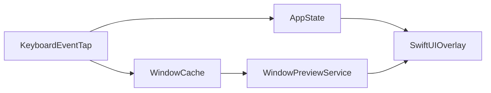

# WindowLens

<p align="center">
  
</p>

WindowLens is an open-source macOS window switcher and native Cmd-Tab preview enhancer.

Cmd-Tab remains the system app switcher owned by macOS and the Dock. WindowLens observes native Cmd-Tab selection and adds preview surfaces without replacing native switching behavior. Option-Tab opens the WindowLens workspace mode for focused window and workspace navigation.

## Current Features

- Native Cmd-Tab preview enhancement driven by the Dock accessibility switcher selection.
- Window previews captured with ScreenCaptureKit.
- Cache-first preview rendering for minimized and off-Space windows.
- Polished placeholders when a live or cached thumbnail is unavailable.
- Liquid Glass interface on macOS 26.
- Option-Tab workspace mode for window-focused navigation.
- Window-level selection within the active workspace surface.
- Search-ready architecture for apps and windows.
- **Settings window** — sidebar navigation (Features, General, Shortcuts, Excluded Apps, Window Slots, Usage Heatmap, Permissions, About) with light frosted-glass chrome and System Settings–style titlebar alignment.
- **Window slots (1–9)** — globally jump to assigned windows; assign or clear slots from Settings.
- **Window visit history** — back/forward across recent windows when the switcher is closed, with optional HUD feedback.
- **Per-module toggles and shortcuts** — enable or disable Window Slots, Window History, Workspace Switcher, and Resource Monitor; customize bindings from Settings.
- **Excluded apps** — hide chosen apps from the switcher list.

## Roadmap

- Current-app window switching.
- Global window search.
- More reliable restore paths for minimized and off-Space windows.
- Project-aware results for editors and development workflows.
- Workspace traversal across Spaces and Stage Manager contexts.

## Requirements

- macOS 26 or newer.
- Swift 6.2 or newer.
- Accessibility permission for window inspection and activation.
- Input Monitoring permission for global shortcuts.
- Screen Recording permission for window previews.

WindowLens targets **macOS 26 only by design** (Liquid Glass UI and current Swift toolchain). Older macOS versions are not supported and are not on the roadmap.

Grant permissions in System Settings -> Privacy & Security.

## Build From Source

```bash
git clone https://github.com/FornaxChemica/WindowLens.git
cd WindowLens
./dev-relaunch.sh
```

That single script:

1. Builds the **WindowLens** scheme with `xcodebuild` (Debug, Apple Development signing)
2. Syncs the product to `/Applications/WindowLens.app`
3. Launches it

Skip the compile step when you only need a relaunch:

```bash
./dev-relaunch.sh --skip-build
```

You can still open `WindowLens.xcodeproj` in Xcode for debugging or tests (`Cmd+U`).

## Testing

```bash
swift test
```

You can also run tests from Xcode with the WindowLens scheme (`Cmd+U`).

Coverage focuses on pure logic in `WindowLens/Tests/WindowLensTests.swift` (~65 cases), including:

- Fuzzy matching, preferences/shortcuts, and window usage store persistence
- Finder window refinement and preview merge identity
- Modifier-key tracking and related helpers

Live CGEventTap and ScreenCaptureKit paths are not covered by unit tests.

## Testing

```bash
swift test
```

You can also run tests from Xcode with the WindowLens scheme (`Cmd+U`).

Coverage focuses on pure logic in `WindowLens/Tests/WindowLensTests.swift` (~65 cases), including:

- Fuzzy matching, preferences/shortcuts, and window usage store persistence
- Finder window refinement and preview merge identity
- Modifier-key tracking and related helpers

Live CGEventTap and ScreenCaptureKit paths are not covered by unit tests.

## Interaction Model

| Shortcut | Behavior |
| --- | --- |
| Cmd-Tab | Native macOS app switching, enhanced with WindowLens previews |
| Quick Option-Tab | Switch to the next window of the current app |
| Hold Option-Tab | Show the current-app window carousel |
| Tab / Shift-Tab | Cycle current-app windows while the carousel is open |
| Space or / | Pin the overlay and open global window search |
| Cmd-1 | Scope pinned search to the current app |
| Cmd-2 | Scope pinned search to all windows |
| Return | Open the selected search result or confirm selection |
| Escape | Dismiss the WindowLens overlay |
| ⌘, | Open Settings |
| Modifier + 1–9 | Jump to window slot (when Window Slots is enabled) |
| Configurable | Window history back / forward (see Settings → Features) |

## Architecture Notes

WindowLens intentionally separates two interaction systems:

- Native Cmd-Tab augmentation: passive, Dock-authoritative, preview-focused.
- WindowLens workspace mode: active, keyboard-focused, window/workspace-oriented.



The SwiftUI overlay is `SwitcherView`, hosted in `SwitcherPanel`. Diagnostics use OSLog; filter by subsystem in Console.app.

The native Cmd-Tab path should not consume or replace Cmd-Tab. The Dock remains responsible for app traversal and activation.

## Attribution

WindowLens started as a fork of BetterTabbing by Sid Premkumar and has been significantly extended and reworked by Chakshu Jain.

The project is inspired by BetterTabbing and by high-level DockDoor concepts around native macOS preview augmentation. DockDoor code and assets are not copied or vendored; GPL-licensed material should not be incorporated unless this project's license is changed accordingly.

See [ACKNOWLEDGMENTS.md](ACKNOWLEDGMENTS.md) for more detail.

## License

WindowLens is distributed under the MIT License. See [LICENSE](LICENSE).
